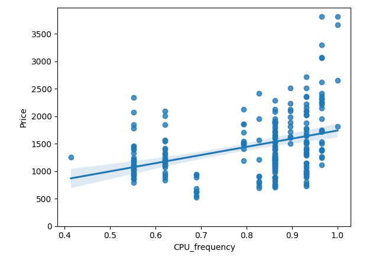
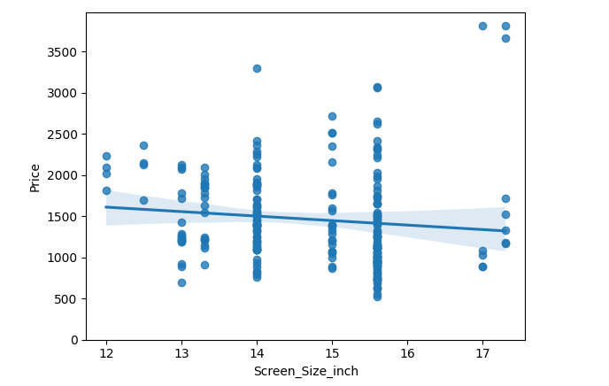
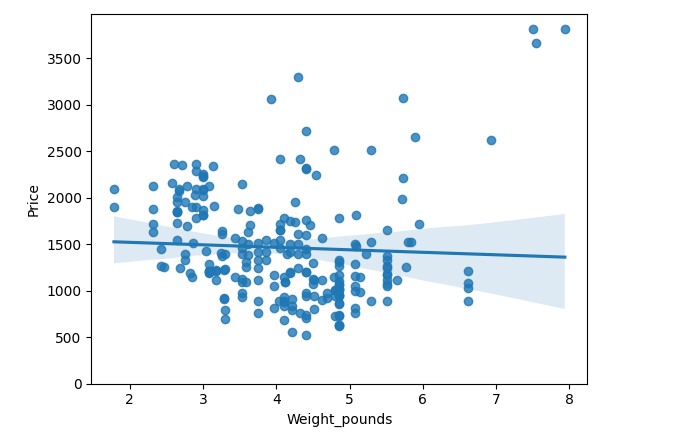
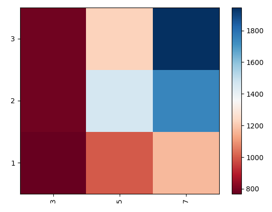

# exploratory-data-analysis-laptop-pricing
Exploratory Data Analysis (EDA) on a laptop pricing dataset using Python, including regression analysis, categorical comparisons, pivot tables, and correlation analysis.
# Laptop Price Analysis (Exploratory Data Analysis)

## Overview

This project explores a laptop pricing dataset using Python to identify which features influence price. The analysis focuses on uncovering relationships between hardware specifications and cost through visualization and statistical techniques.

---

## Tools & Technologies

- Python
- Pandas
- NumPy
- Matplotlib
- Seaborn
- SciPy (for correlation analysis)

---

## Key Insights

### 🔹 CPU Frequency vs Price (Moderate Positive Relationship)

Higher CPU frequency tends to be associated with higher prices. The relationship is moderately positive, indicating performance plays a role in pricing.

---

### 🔹 Screen Size vs Price (Weak Relationship)

Screen size shows a weak relationship with price. Larger screens do not necessarily correspond to significantly higher costs.

---

### 🔹 Weight vs Price (Weak Relationship)

Laptop weight has little impact on price. There is a slight trend, but it is not a strong predictor.

---

### 🔹 Price Distribution by GPU and CPU Core (Heatmap)

The heatmap reveals how average price varies across combinations of GPU types and CPU core counts. Devices with higher specifications tend to cluster in higher price ranges.

---

## Key Takeaways

- CPU performance (frequency) is a moderate driver of price  
- Screen size and weight have minimal impact on pricing  
- Hardware combinations (GPU + CPU cores) influence pricing tiers  
- Visual analysis helps reveal patterns not obvious from raw data  

---

## Why This Matters

This project demonstrates how exploratory data analysis (EDA) can:
- Identify meaningful relationships in real-world datasets  
- Support data-driven decision making  
- Prepare data for predictive modeling  

---

## Project Files

- `exploratory_data_analysis_laptop_pricing.ipynb` → Full analysis notebook  
- `cpu_frequency_vs_price.png` → Moderate positive relationship  
- `screen_size_vs_price.png` → Weak relationship  
- `weight_vs_price.png` → Weak relationship  
- `price_heatmap.png` → Aggregated feature comparison  

---

## Next Steps

- Build regression models to predict laptop prices  
- Perform feature importance analysis  
- Explore additional datasets for comparison  

---

## Author: Diane King

Exploratory Data Analysis project as part of hands-on data analytics training.
